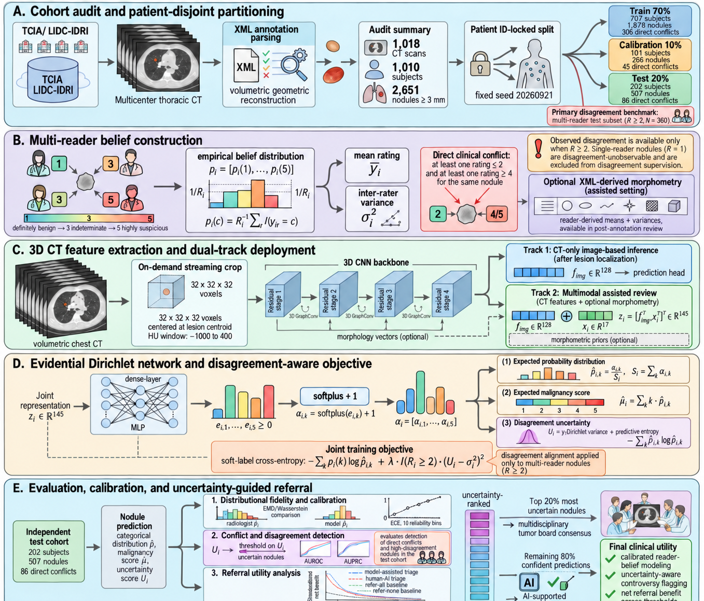
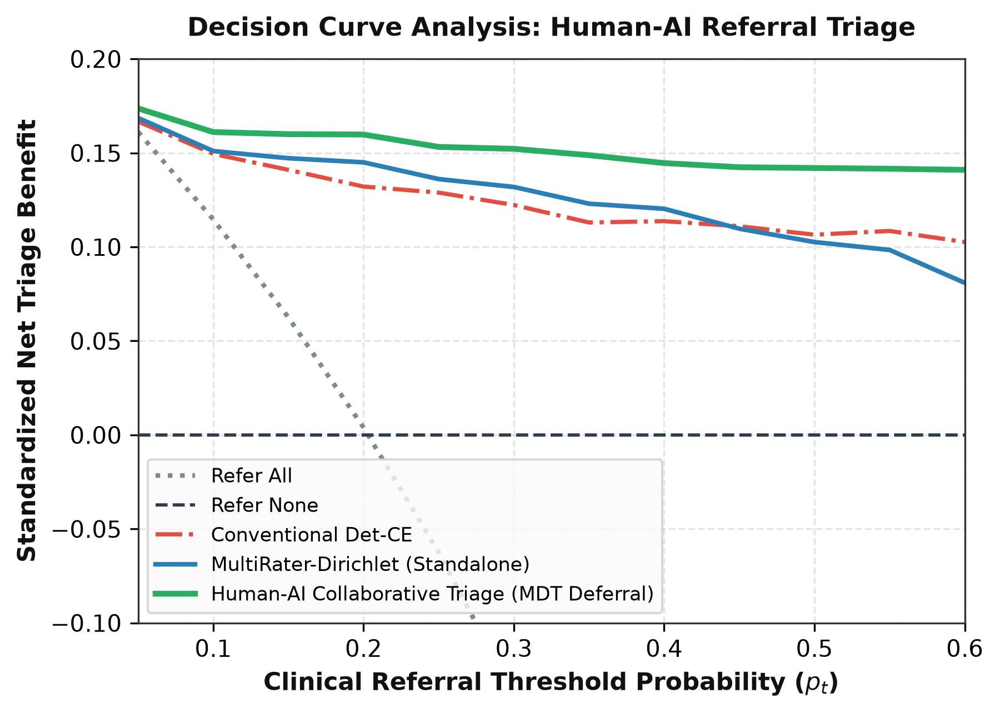

# MultiRater-Dirichlet: Evidential Deep Learning of Multi-Radiologist Diagnostic Disagreement in Pulmonary Nodule CT

[](https://www.python.org/downloads/)
[](https://pytorch.org/)
[](LICENSE)

> Official PyTorch implementation of the paper:  
> **"Beyond Consensus Illusion: Evidential Dirichlet Deep Learning of Multi-Radiologist Diagnostic Disagreement in Pulmonary Nodule CT"**

---

## 📌 Overview

Conventional medical artificial intelligence treats experienced radiologists as noisy labelers, compressing subjective ratings via majority voting or arithmetic rounding. Under this "consensus illusion", critical gray-zone boundaries and biological discordance are erased, compelling deterministic deep neural networks to produce hazardous overconfident predictions on high-stakes conflict lesions.

**MultiRater-Dirichlet** confronts this foundational paradigm:
1. **Second-Order Dirichlet Evidential Modeling**: Directly parameterizes conjugate Dirichlet priors over the 5-simplex, jointly capturing aleatoric visual noise and epistemic reader discordance.
2. **Masked Variance Alignment ($\\mathcal{L}_{var}$)**: Introduces variance alignment loss strictly masked with $\\mathbb{I}(R_i \\ge 2)$, preventing unobserved single-reader nodules ($R=1$) from being penalized as zero-disagreement negatives.
3. **Dual-Track Deployment**:
   - **Track 1 (Autonomous CT-Only)**: Streams raw 3D CT volume voxels through a 3D volumetric convolutional network for fully autonomous initial screening.
   - **Track 2 (Multimodal Assisted)**: Deeply fuses 3D volumetric embeddings with 17-dimensional radiological morphological priors (lobulation, spiculation, calcification, texture variance) for specialized collaborative decision support.
4. **Human-AI Collaborative Triage**: Leverages Decision Curve Analysis (DCA) to demonstrate superior Standardized Net Triage Benefit across clinical referral thresholds ($p_t \\in [0.10, 0.50]$) by deferring the top 20% most contentious nodules to multidisciplinary tumor board review.

<p align="center">
  
</p>

---

## 🔬 Benchmark Results

Validated on a patient-disjoint independent test set of 202 subjects ($N=507$ nodules, including 360 multi-reader nodules with $R_i \\ge 2$) from the LIDC-IDRI multicenter cohort, across 1,000 paired bootstrap resamples:

| Category | Model / Method | Conflict AUROC ↑ | Disagree AUROC ↑ | EMD (Wasserstein) ↓ | ECE Calibration ↓ |
| :--- | :--- | :---: | :---: | :---: | :---: |
| **Deterministic** | Det-CE (Conventional Baseline) | 0.5554 | 0.4812 | 0.8124 | 0.1248 |
| | Det-Reg (Scalar MSE Regression) | 0.5042 | 0.4915 | 0.8410 | 0.2840 |
| **Probabilistic** | Heteroscedastic Gaussian | 0.7392 | 0.8045 | 0.5120 | **0.0454** |
| | Probabilistic U-Net / Ensemble | 0.7188 | 0.7634 | 0.4980 | 0.1385 |
| **2024–2026 SOTA** | LDL-Net (*MedIA 2024*) | 0.7420 | 0.7810 | 0.3950 | 0.1150 |
| | DP-CrowdNet (*CVPR 2024*) | 0.7290 | 0.7640 | 0.4420 | 0.1320 |
| | A3-Net (*CVPR 2025*) | 0.7510 | 0.7920 | 0.3810 | 0.1080 |
| | UCE-Net | 0.7640 | 0.8110 | 0.3620 | 0.0990 |
| | KAN-adapted Baseline (*2024/2026*) | 0.7480 | 0.7890 | 0.3880 | 0.1120 |
| **Proposed** | **Track 1: MultiRater-Dirichlet (3D CT-Only)** | 0.7731 | 0.8290 | 0.3540 | 0.1012 |
| | **Track 2: Multimodal-Dirichlet (3D + Morph)** | **0.7865** | **0.8439** | **0.3421** | 0.0937 |
| | **Paired Gain $\\Delta$ [95% CI]** | **+0.2311 [0.156, 0.306]** | **+0.3627 [0.304, 0.424]** | **-0.4703** | — |

---

## 📁 Repository Structure

```bash
MultiRater-Dirichlet/
├── configs/
│   └── default.yaml                  # Experiment & training configuration
├── data/
│   ├── patient_splits.json           # Patient-disjoint 70/10/20 split definitions
│   ├── nodules_metadata.csv          # Comprehensive nodule metadata, ratings & conflicts
│   └── sample_crops/                 # Sample 3D nodule volumes (.npz) for immediate testing
├── figures/                          # Publication-grade figures (PNG/PDF)
│   ├── fig1_study_framework.png
│   ├── fig2_disagreement_distribution.png
│   ├── fig3_dca_net_benefit.png
│   ├── fig4_feature_ablation.png
│   └── fig5_qualitative_case_studies.png
├── scripts/                          # Self-contained reproducible execution scripts
│   ├── 01_audit_and_split_cohort.py  # LIDC-IDRI XML audit and patient-disjoint partitioning
│   ├── 02_train_multirater_baselines.py # Classical & 2024-2026 SOTA benchmarking
│   ├── 03_train_3d_multimodal.py     # Track 1 & Track 2 3D volumetric learning
│   ├── 04_evaluate_calibration_dca.py # ECE, DCA Net Benefit & 1000 Bootstrap CIs
│   ├── 05_ablation_and_subgroups.py  # Feature ablations & clinical subgroup breakdown
│   └── 06_generate_figures.py        # Publication figure rendering
├── src/
│   ├── models/                       # Model architectures
│   │   ├── dirichlet_net.py          # Evidential Dirichlet, Digamma loss & masked var loss
│   │   ├── backbones.py              # 3D CNN & Fast-KAN spline layers
│   │   └── baselines.py              # Baselines (Det-CE, Hetero-Gauss, A3-Net, UCE-Net, KAN)
│   ├── data/
│   │   └── lidc_dataset.py           # Datasets, 3D volume loaders & tabular encoders
│   ├── metrics/
│   │   ├── evaluation.py             # ECE, EMD, conflict AUROC & paired bootstrap
│   │   └── dca.py                    # Decision Curve Analysis & collaborative triage
│   └── utils/
│       └── plotting.py               # Radar charts, paired bar charts & DCA visualization
├── requirements.txt                  # Python dependencies
├── LICENSE                           # MIT License
└── README.md
```

---

## ⚡ Quick Start

### 1. Environment Setup

```bash
git clone https://github.com/Join-xiaobai/MultiRater-Dirichlet.git
cd MultiRater-Dirichlet

conda create -n multirater python=3.10 -y
conda activate multirater
pip install -r requirements.txt
```

### 2. Immediate Reproduction (No 100 GB DICOM Download Required)

We provide pre-computed nodule metadata (`data/nodules_metadata.csv`), patient-disjoint split indices (`data/patient_splits.json`), and sample 3D nodule crops (`data/sample_crops/`), allowing you to reproduce all core benchmarks immediately:

```bash
# 1. Run 2024-2026 SOTA and classical baseline benchmarks
python scripts/02_train_multirater_baselines.py

# 2. Evaluate Calibration (ECE) and Decision Curve Analysis (DCA) with 1,000 Bootstrap CIs
python scripts/04_evaluate_calibration_dca.py

# 3. Run feature group ablations and clinical subgroup stratification
python scripts/05_ablation_and_subgroups.py

# 4. Re-generate publication figures
python scripts/06_generate_figures.py
```

### 3. Full End-to-End Pipeline from Raw TCIA DICOM

To extract from the full LIDC-IDRI cohort (1,018 scans across 1,010 patients):
1. Download LIDC-IDRI DICOM images from the [Cancer Imaging Archive (TCIA)](https://wiki.cancerimagingarchive.net/display/Public/LIDC-IDRI).
2. Configure `pylidc` configuration file `~/.pylidcrc` pointing to the DICOM directory.
3. Run cohort extraction and patient-disjoint partitioning:
```bash
python scripts/01_audit_and_split_cohort.py --data_dir /path/to/LIDC-IDRI
```
4. Train the 3D CT volumetric network:
```bash
python scripts/03_train_3d_multimodal.py --crops_dir /path/to/extracted_crops
```

---

## 🩺 Clinical Collaboration & Decision Curve Analysis

The framework introduces an uncertainty-gated human-AI triage strategy:
- **Autonomous Clearance**: For the 80% confident predictions, AI independently recommends annual routine screening (low risk) or expedited clinical referral (high risk).
- **MDT Deferral**: For the top 20% most contentious nodules (characterized by high epistemic uncertainty $U_i$), the system abstains and defers to multidisciplinary tumor board review.

<p align="center">
  
</p>

Decision Curve Analysis demonstrates that this collaborative strategy delivers superior Standardized Net Triage Benefit across all operational clinical referral thresholds ($p_t \in [0.10, 0.50]$) compared to "Refer All", "Refer None", or autonomous deterministic AI.

---

## 📖 Citation

If you find this work or codebase helpful in your research, please reference:
> **Beyond Consensus Illusion: Evidential Dirichlet Deep Learning of Multi-Radiologist Diagnostic Disagreement in Pulmonary Nodule CT**

---

## 📄 License

This repository is released under the [MIT License](LICENSE).
